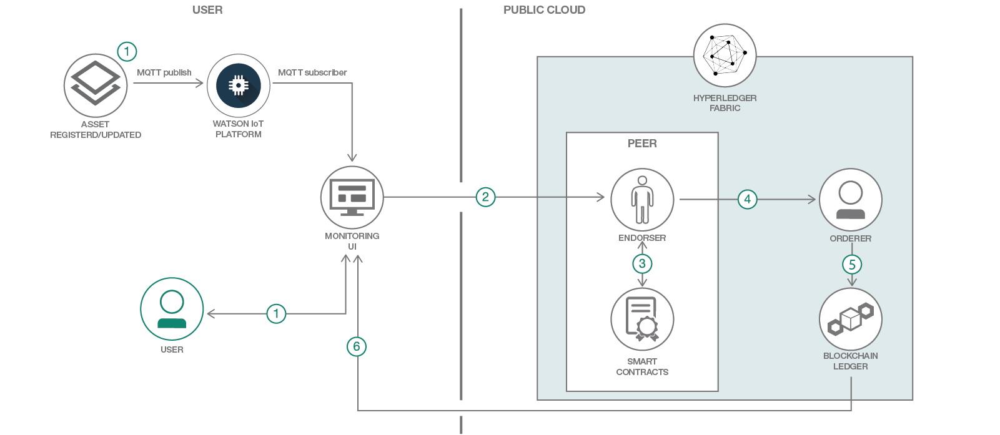

# Blockchain Monitoring UI

In this Code Pattern, we'll use React.js, Watson IoT Platform, and the Hyperledger Fabric Node SDK to interact with an IBM Blockchain service. The resulting application provides a dynamically generated user interface to monitor assets as they traverse through a supply chain. This solution can be applicable for both physical assets (shipping containers, packages) and financial assets.Operators can use this Monitoring UI to perform actions on the blockchain, see the results of those actions, and query the state of each asset in the blockchain ledger.

When the reader has completed this Code Pattern, they will understand how to:

* Deploy a Hyperledger Blockchain network on IBM Cloud
* Create and enroll a administrative client using the Hyperledger Node SDK
* Deploy and Instantiate a smart contract to handle asset updates/queries
* Create a schema describing the properties of an asset
* Monitor and propose blockchain transactions via a UI
* Integrate Watson IoT platform to directly receive asset updates from registered IoT devices via MQTT or HTTP



## Flow

1. A request is submitted to Create, Read, Update, or Delete an asset from a blockchain ledger. This request may either be submitted manually by a user via the monitoring UI browser, or from a IoT device (NFC/barcode scanner, etc) publishing a MQTT message to the Watson IoT Platform.

2. Node Express backend formats CRUD request into a [jsonrpc](http://www.jsonrpc.org/specification#examples) object like below, and submits it to a Hyperledger peer as a transaction proposal.

```json
{
    'jsonrpc': '2.0',
    'method': 'invoke',
    'params': {
        'type': 1,
        'chaincodeID': {
            'name': 'simple_contract'
        },
        'ctorMsg': {
            'function': 'createAsset',
            'args': '["assetID", {"carrier": "Port of Long Beach", "longitude":"33.754185", "latitude": "-118.216458", "temperature": "44 F"}]'
        },
        'secureContext': 'kkbankol@us.ibm.com'
    },
    'id': 5
}
```

3. Peer uses an "endorsement" service to simulate the proposed transaction against the relevant smart contracts. This endorsement service is used to confirm that the transaction is possible given the current state of the ledger. Examples of invalid proposals might be creating an asset that already exists, querying the state of an asset that does not exist, etc.

4. If the simulation is successful, the proposal is then "signed" by the peer's endorser.

5. The signed transaction is forwarded to an ordering service, which executes the transactions and places the result into the ledger.

6. The Monitoring UI auto-refreshes to show the transaction result and updated ledger in the "Response Payloads" and "Blockchain" columns, respectively.

## Install Prerequisites:
### IBM Cloud CLI
To interact with the hosted offerings, the IBM Cloud CLI will need to be installed beforehand. The latest CLI releases can be found at the link [here](https://console.bluemix.net/docs/cli/reference/ibmcloud/download_cli.html#download_install). An install script is maintained at the mentioned link, which can be executed with one of the following commands.

```bash
# Mac OSX
curl -fsSL https://clis.ng.bluemix.net/install/osx | sh

# Linux
curl -fsSL https://clis.ng.bluemix.net/install/linux | sh

# Powershell
iex(New-Object Net.WebClient).DownloadString('https://clis.ng.bluemix.net/install/powershell')
```

After installation is complete, confirm the CLI is working by printing the version like so

```bash
ibmcloud -v
```

### Node.js packages

If expecting to run this application locally, please continue by installing [Node.js](https://nodejs.org/en/) runtime and NPM. Currently the Hyperledger Fabric SDK only appears to work with node v8.9.0+, but [is not yet supported](https://github.com/hyperledger/fabric-sdk-node#build-and-test) on node v9.0+. If your system requires newer versions of node for other projects, we'd suggest using [nvm](https://github.com/creationix/nvm) to easily switch between node versions. We did so with the following commands.

```bash
curl -o- https://raw.githubusercontent.com/creationix/nvm/v0.33.11/install.sh | bash
# Place next three lines in ~/.bash_profile
export NVM_DIR="$HOME/.nvm"
[ -s "$NVM_DIR/nvm.sh" ] && \. "$NVM_DIR/nvm.sh"  # This loads nvm
[ -s "$NVM_DIR/bash_completion" ] && \. "$NVM_DIR/bash_completion"  # This loads nvm bash_completion
nvm install v8.9.0
nvm use 8.9.0
```

To run the Monitoring UI locally, we'll need to install a few node libraries which are listed in our `package.json` file.
- [React.js](https://reactjs.org/): Used to simplify the generation of front-end components
- [MQTT](http://mqtt.org/): Client package to subscribe to Watson IoT Platform and handle incoming messages
- [Hyperledger Fabric SDK](https://fabric-sdk-node.github.io/): Enables backend to connect to IBM Blockchain service

Install the Monitoring UI node packages by running `npm install` in the project root directory and in the [react-backend](react-backend) directory. Both `python` and `build-essential` are required for these dependencies to install properly:

```bash
npm install
cd react-backend && npm install
```

Finally, compile the `bundle.js` file
```bash
cd public
npm run build
```

## Included components
* [Blockchain](https://console.bluemix.net/catalog/services/blockchain)
* [Watson IoT Platform](https://console.bluemix.net/catalog/services/internet-of-things-platform)

## Featured technologies
* [Hyperledger Fabric](https://hyperledger-fabric.readthedocs.io/en/release-1.1/)
* [MQTT](http://mqtt.org/faq)
* [npm](https://www.npmjs.com/)
* [node.js](https://nodejs.org/en/)
* [Hyperledger Node.js SDK](https://github.com/hyperledger/fabric-sdk-node)

# Watch the Videos

[](https://www.youtube.com/watch?v=Mw6924hCAIc)

[](https://www.youtube.com/watch?v=DYvdN_p_Ldk)

# Steps
There are two methods we can use to deploy the application, either use the ``Deploy to IBM Cloud`` steps **OR** create the services and run locally.
1. [Clone repository](#1-clone-the-repository)
2. [Setup repository codebase locally](#2-deploy-application-locally) OR [Deploy to IBM Cloud](#2-deploy-application-to-ibm-cloud)
3. [Create Watson services with IBM Cloud](#3-create-services)
4. [Upload and Instantiate Chaincode](#4-upload-and-instantiate-chaincode)
5. [Start the Application](#5-run-the-application)
6. [Retrieve service credentials](#6-obtain-service-credentials)
7. [Configure and run the application](#7-ui-configuration)

## 1. Clone the repository

Clone the `monitoring_ui` project locally. In a terminal, run:

```bash
git clone https://github.com/IBM/monitoring_ui.git
```

## 2. Deploy Application to IBM Cloud

1. To deploy the application to IBM Cloud, we'll need to leverage the IBM Cloud CLI. Ensure the cli is installed using the prerequisites section above, and then run the following command to deploy the application.

```bash
ibmcloud cf push
```

2. To see the app and services created and configured for this Code Pattern, use the IBM Cloud dashboard, or run `ibmcloud cf apps` and `ibmcloud cf services` in the terminal. The app should be named `monitoring-ui` with a unique suffix.

## 2. Deploy Application locally
Install the Monitoring UI node packages by running `npm install` in the project root directory and in the [react-backend](react-backend) directory. Both `python` and `build-essential` are required for these dependencies to install properly:

```bash
npm install
cd react-backend && npm install
```

Finally, compile the `bundle.js` file

```bash
cd public
npm run build
```

### Docker setup (optional)
If you have Docker installed, you can install these dependencies in a virtual container instead. Run the application with the following commands, and then skip to [Step 5](#5-configure-credentials).

```bash
docker build -t monitoring_ui .
docker run -d -p 8081:8081 monitoring_ui
```

> NOTE: These steps are only needed when running locally instead of using the ``Deploy to IBM Cloud`` button.

## 3. Create Services

Next, we'll need to deploy our service instances using the IBM Cloud dashboard.

### Watson IoT Platform
We can start by deploying an instance of the Watson IoT Service. In this pattern, the primary role of this service is to offer an secure MQTT broker that'll receive asset updates from IoT devices. Our Monitoring UI subscribes to the MQTT broker and processes incoming messages with the fabric-client node SDK.

First, log into the IBM Cloud dashboard at [https://console.bluemix.net/](https://console.bluemix.net/) and select the "Catalog" button in the upper right.


In the search bar type "IoT" and click the icon titled "Internet of Things Platform Starter".


Once this service is provisioned, we'll need to generate a set of credentials for connecting to the broker. We can do so by entering the IoT Platform dashboard, selecting "Devices" from the left hand menu, and then clicking the "Add Device" button.


Next, provide a device type and ID.


The next two steps (Device Information, Groups) can be skipped.

In the "Security" tab, an Authentication token can be entered as long as it meets certain criteria (between 8 and 36 characters, contains mix of lowercase/uppercase letters, numbers, and symbols). Leave this field blank if you'd like for one to be generated instead.


Clicking the "Finish" button will generate a set of credentials that can be used to publish messages to the IoT Platform.


Now, MQTT publish commands can be made from a device in the following format:

* Client ID: `d:${organization_id}:${device_type}:${device_id}`
* Username: `use-token-auth`
* Password: `${authentication_token}`
* Endpoint: `${organization_id}.messaging.internetofthings.ibmcloud.com`

To publish messages, a MQTT client will need to be installed on the IoT devices responsible for reading and sending asset updates. These clients are very lightweight, and are able to run on resource constrained devices such as Arduino, Raspberry Pi, CHIP, etc.

Now that we have a valid set of credentials, we can use an MQTT client to send a sample command. There are a few clients available online, but for simplicity we'll use a node cli client. This particular client can be installed by running `npm install -g mqtt`, and is also used by the Monitoring UI backend. After exporting the MQTT credentials we can publish a json payload with the following commands:

```bash
organization_id=agf5n9
device_type=assetTracker
device_id=702f6460
username=use-token-auth
password=YTiRp4jRdt4oyKTS3a

mqtt_pub -i "d:${organization_id}:${device_type}:${device_id}" -u "${username}" -P "${password}" -h "${organization_id}.messaging.internetofthings.ibmcloud.com" -p 1883 -t 'iot-2/evt/deviceupdate/fmt/json' -m '{
    "d" : {
          "fcn" : "updateAsset",
          "args" : "[{"carrier": "LBC Freight 647", "longitude":"34.754185", "latitude": "-119.214458", "temperature": "45 F"}]"
          }
}'
```

And the we can see that message has been received by the IoT Platform dashboard by going back to the "Devices" menu, selecting our corresponding device, and then selecting "Recent Events".


### Blockchain

We can continue on by deploying the IBM Blockchain service. This can be found by logging in to the IBM Cloud [dashboard](https://console.bluemix.net/), selecting the "Catalog" button, searching for "Blockchain", and clicking on the resulting icon. Or click this [*link*](https://console.bluemix.net/catalog/services/blockchain).


After selecting the blockchain icon, a form will be presented for configuring the service name, region, and pricing plan. The default values for these fields can be left as is. Also, be sure that the free pricing tier is selected, which is titled "Starter Membership Plan". If you are using an IBM Cloud Lite account, this plan can be used for free for up to 30 days. After validating that the information in the form is correct, scroll down and click the "Create" button in the lower right corner.


## 4. Upload and Instantiate Chaincode
"Smart contracts", commonly referred to as "Chaincode", can be used to execute business logic and validate incoming requests. In this context, the contracts are used to implement CRUD operations for tracking assets on the IBM Blockchain ledger.

To begin the process of uploading the smart contracts to the blockchain, we can start by opening the IBM Cloud dashboard, selecting your provisioned Blockchain service, and accessing the blockchain network monitor by clicking "Enter Monitor".


Next, click the "Install code" option on the left hand menu, and then the "Install Chaincode" button on the right of the page.


Enter an id and a version (here we'll use "simple_contract" and "v1"). Then, select the "Add Files" button to upload the [samples.go](contracts/basic/simple_contract/samples.go), [schemas.go](contracts/basic/simple_contract/schemas.go), and [simple_contract_hyperledger.go](contracts/basic/simple_contract/simple_contract_hyperledger.go) files.


Finally, we'll need to Instantiate the chaincode. This can be done by opening the chaincode options menu and selecting "Instantiate".

This will present a form where arguments can be provided to the chaincodes `init` function. In this case, we'll just need to provide a json string `{"version":"1.0"}` in the Arguments section, and then click "Submit".


For additional documentation on the chaincode implementation, please see the README in the [simple_contract](contracts/basic/simple_contract) directory.

<!--
### Manual installation
Otherwise, continue by installing [Node.js](https://nodejs.org/en/) runtime and NPM. Currently the Hyperledger Fabric SDK only appears to work with node v8.9.0+, but [is not yet supported](https://github.com/hyperledger/fabric-sdk-node#build-and-test) on node v9.0+. If your system requires newer versions of node for other projects, we'd suggest using [nvm](https://github.com/creationix/nvm) to easily switch between node versions. We did so with the following commands
```
curl -o- https://raw.githubusercontent.com/creationix/nvm/v0.33.11/install.sh | bash
# Place next three lines in ~/.bash_profile
export NVM_DIR="$HOME/.nvm"
[ -s "$NVM_DIR/nvm.sh" ] && \. "$NVM_DIR/nvm.sh"  # This loads nvm
[ -s "$NVM_DIR/bash_completion" ] && \. "$NVM_DIR/bash_completion"  # This loads nvm bash_completion
nvm install v8.9.0
nvm use 8.9.0
```

Install the Monitoring UI node packages by running `npm install` in the project root directory and in the [react-backend](react-backend) directory. Both `python` and `build-essential` are required for these dependencies to install properly:
```
npm install
cd react-backend && npm install
```

Finally, compile the `bundle.js` file
```
cd public
npm run build
```

Method	| Command	|Comment
--- | --- | ---
Filesystem | `npm run build` | The build command generates the bundle.js file in the public directory. </br>To access the Monitoring UI, go to the `monitoring_ui/public` directory and open the *index.html* file in a browser.
-->

## 5. Run the application

1. Start the app locally with `npm run dev-server`.

2. To access the Monitoring UI, open the following URL in a browser: `http://localhost:8081/` </br>**Note:** If you run into an issue with the port already being used, set the `PORT` environment variable to the port you'd like to use. Note that hot reload is enabled for the webpack-dev-server. Changes that you save to the source are immediately reflected in the Monitoring UI. There is no need to manually reload.
> Note: server host can be changed as required in server.js and `PORT` can be set in `.env`.


## 6. Obtain service credentials

The credentials for IBM Cloud services (Blockchain, Watson IoT Platform), can be found in the ``Services`` menu in IBM Cloud by selecting the ``Service Credentials`` option for each service.

The Blockchain credentials consist of the `key`, `secret`, and `network_id` parameters.


These credentials will need to be provided to the UI in the next step.

## 7. UI Configuration

Before we're able to access blockchain information via the Monitoring UI, we'll need to provide a bit of information about our Blockchain service, such as the API credentials/endpoint, and chaincode information.

First, access the configuration form by clicking **CONFIGURATION**.  


This form accepts the following parameters:

Parameter	|Value	|Comment
--- | --- | ---
API Host and Port	| http://peer_URL:port	| The host and port for the IBM Blockchain REST API prepended with `http://`.
Chaincode ID	| The contract ID that was returned when you registered the contract.	| The contract ID should be a string that was provided in the previous "Install / Instantiate Chaincode" step. If the ID is incorrectly entered, the UI will display the blockchain ledger entries, but the asset search function will not work.
Secure Context|Your fabric user	| This is required for connecting to Blockchain instances on IBM Cloud. **Important:** For secureContext use the user name that was used to configure the fabric.
Number of blocks to display	| A positive integer. Default: 10	| The number of blockchain blocks to display.
Key | API Key | Provided in IBM Cloud Credentials
Secret | API Secret | Provided in IBM Cloud Credentials
Network Id | Blockchain network id | Provided in IBM Cloud Credentials

After filling out and submitting the form, a request will be sent to the `/init_client` endpoint with the provided parameters.

Once this endpoint is invoked, it will call a series of methods to carry out the following:
- Fetch the network [configuration file](https://hyperledger.github.io/composer/latest/reference/connectionprofile). This file contains information about all of the components in the blockchain network, such as the name/endpoints of associated peers, channels, organizations, orderers, and certificate authorities.
- Initialize our hyperledger "client" by loading the configuration file via the Node Hyperledger SDK.
- Create/enroll a fabric user named "monitoring_user" with administrative privileges. These elevated privileges are required to invoke and query chaincode methods. To obtain these privileges, the SDK must send a request to the blockchain "certificate authority" listed in the connection profile for a certificate/key pair. Once this is complete, a PEM encoded Certificate will be output to the server logs like so.

<!-- point it to a blockchain peer server and provide a contract ID to monitor. A "peer" is a member of a blockchain network that hosts copies of a ledger and smart contracts -->


The certificate will need to be manually uploaded to one of the blockchain peers via the blockchain network monitor. A [peer](http://hyperledger-fabric.readthedocs.io/en/release-1.1/peers/peers.html) is a member of a blockchain network responsible for hosting copies of the ledger and chaincode. These are the primary interaction endpoint for both administrators and members with limited access. For a client to carry out administrative requests, they must have a PEM certificate that has been uploaded to the peer. The chaincode operations will not work until this step has been completed.

This can be done by going back to the IBM Cloud dashboard, selecting your provisioned Blockchain service, and accessing the blockchain network monitor by clicking "Enter Monitor".


After entering the Network Monitor, select the "Members" section from the left hand menu. Then, select the "Certificate" option, and click "Add certificate".


Clicking "Add certificate" will present the following form:


The user interface is divided into three columns.  
1. Chaincode Operations
2. Response Payloads
3. Blockchain


### The Chaincode Operations column
The first section of the Monitoring UI is dynamically generated through a combination of JSON Schema and convention. The tabs each represent a subset of the available contract functions and are hardcoded in the `ChaincodeReducer.js` file.     
The contract functions can be selected from the menu in each tab. The functions and their related input fields are defined in the JSON schema.

For example, if we are connected to the IBM sample conctract on the blockchain fabric the **Create** tab includes just one function: `createAsset`. This function maps to the `createAsset` function that is defined in the JSON schema. The UI knows to put `createAsset` under the `create` tab because it matches the tab's name as a substring of the function. The **Read** tab, in contrast, contains three functions each of which are defined in the JSON schema. Each tab also has a corresponding `type`, which controls the use of Hyperledger invoke or query endpoint.

The *arguments* form is generated when you select a particular function. The form creates input fields for the arguments that are defined in the JSON schema. The basic contract includes the following fields: `assetID`, `carrier`, `location`, `temperature`, and `timestamp`.  

**Note:**
- Fields such as `assetID` that are denoted with asterisk are required. Required fields are defined in the JSON schema.
- Location is a nested object with its own properties that in turn are exposed as data fields.
- Validation is defined in the JSON schema and is reflected in the form.  
For example, if you submit the form without an entry for the required `assetID` field, you are prompted to enter a value. If you enter a non-numeric value in the `latitude` or `longitude` fields, you will also be prompted.

When you submit a form the Monitoring UI creates a valid blockchain REST payload with the field input as arguments. The payload and a request is sent to the configured blockchain peer. The Monitoring UI then waits for a response from the peer. The response is displayed in the Request Payload column.

### The Response Payload column
The second column displays the response from the blockchain peer by recursively traversing the payload and writing the responses to the card. If you submit multiple requests from a combination of tabs the Monitoring UI generates cards as needed to display the payload. **Note:** Duplicate REST request with the exact same function and arguments will not create extra cards.

Request payload cards are displayed in the collapsed state. You must expand the cards to view the contents of the card.

Close individual cards by clicking **x** next to the card header.

Click **Clear** on the Request Payload header to remove all payloads from the display.

**Tip:** Enable the **Poll for changes** toggle to have the Monitoring UI actively check for changes to a particular query every time the blockchain height changes. For the basic contract, use this feature to monitoring a particular asset for changes.

### The Blockchain column
The third column shows the current state of the blockchain.

To expand a block, click the expander. The contents of the block show the transactions in the block and the details for each transaction.

**Important:** Any transactions that occur against a specific blockchain will appear within blocks on the blockchain. These include invalid transactions as well as transactions against other contracts. To see a change on a specific contract, the Monitoring UI must be configured to connect to that contract.

# Troubleshooting

* `sendPeersProposal - Promise is rejected: Error: 2 UNKNOWN: chaincode error (status: 500, message: Authorization for GETINSTALLEDCHAINCODES on channel getinstalledchaincodes has been denied with error Failed verifying that proposal's creator satisfies local MSP principal during channelless check policy with policy [Admins]: [This identity is not an admin]`
> This error occurs if the certificate generated by the SDK user has not been uploaded to the peer.

* `Error: The gRPC binary module was not installed. This may be fixed by running "npm rebuild"`
> `grpc` is a requirement for the fabric-client SDK. Confirm that is has been installed in the `react_backend` directory with `npm install grpc@1.11.0`.

# Links
Blockchain Supply Chain articles
- https://aqurus.ca/blockchain-crucial-link-supply-chain/

Tutorial to scanned barcode result to Watson IoT Platform
- https://www.kevinhoyt.com/2016/11/09/tessel-barcode-scanner-software/

# Learn more

* **IoT Code Patterns**: Enjoyed this Code Pattern? Check out our other [IoT Code Patterns](https://developer.ibm.com/code/technologies/iot/).
* **Blockchain Patterns**: Enjoyed this Code Pattern? Check out our other [Blockchain Patterns](https://developer.ibm.com/code/technologies/blockchain/)
* **Emerging Tech Code Pattern Playlist**: Bookmark our [playlist](https://www.youtube.com/playlist?list=PLzUbsvIyrNfkmf4_91eLqELe6e0tFR_9W) with all of our Code Pattern videos
* **Kubernetes on IBM Cloud**: Deliver your apps with the combined the power of [Kubernetes and Docker on IBM Cloud](https://www.ibm.com/cloud-computing/bluemix/containers)

# License
This code pattern is licensed under the Apache Software License, Version 2.  Separate third party code objects invoked within this code pattern are licensed by their respective providers pursuant to their own separate licenses. Contributions are subject to the [Developer Certificate of Origin, Version 1.1 (DCO)](https://developercertificate.org/) and the [Apache Software License, Version 2](http://www.apache.org/licenses/LICENSE-2.0.txt).

[Apache Software License (ASL) FAQ](http://www.apache.org/foundation/license-faq.html#WhatDoesItMEAN)
